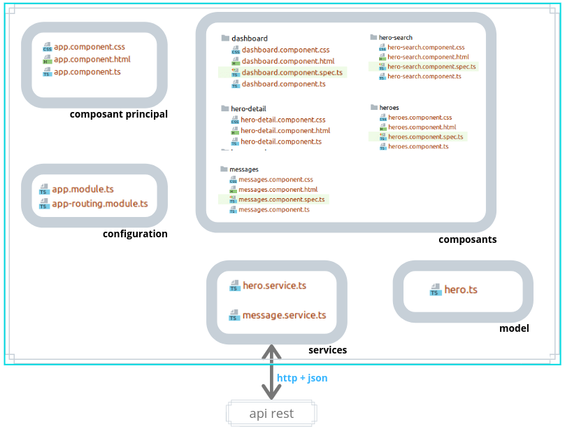

# toh-angular8

Fullstack, fulltech!

- backend : java spring hibernate + tests unitaires + gadle
- frontend : angular 8

Je vous recommande d'essayer intellij qui vous permet d'intégrer dans un même environnement le developpement front, le back et la bdd.

#### Architecture

Le back et le front sont dans deux repos différents (on aurait pu les mettre dans le même, la seule raison est qu'ils ont été développés à des moments différents).

- back : <https://github.com/jtobelem-simplon/toh-backend-tests.git>
- front : <https://github.com/jtobelem-simplon/toh-angular8.git>

Vous pouvez ajouter ces deux parties dans un même projet sous intellej en utilisant des modules.

#### Fonctionnement front

